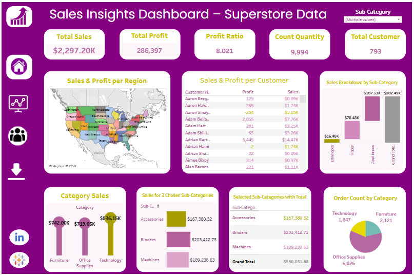
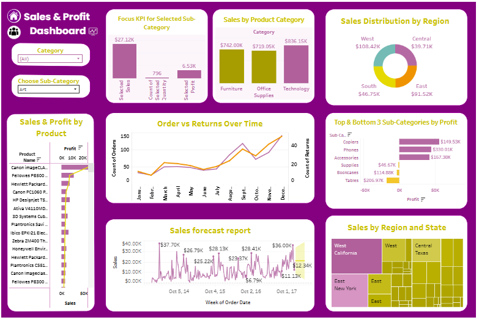
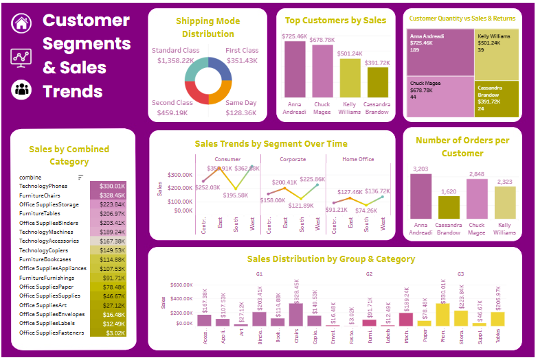

# Tableau-Data-Analysis-Project
Tableau project for analyzing sales and profit using the Sample Superstore dataset. Includes interactive dashboards such as sales forecasting, category-wise analysis (lollipop chart), regional profit distribution, and customer-level insights.

## 💡 Project Title:
**Sales Insights Dashboard using Tableau**

## 📁 Project Overview:
This project uses Tableau to analyze Superstore sales data. It includes visualizations of:
- Sales Forecasting
- Sales by Category using Lollipop Chart
- Regional Profit Distribution
- Top & Bottom Profit Performers using Sets
- Parameterized Sub-category Analysis

## 🔧 Tools Used:
- Tableau Public / Tableau Online
- Excel (for data source)
- GitHub (for version control & publishing)

## 📈 Dashboards Included:
1. **Sales Forecast** – Trend and projection based on historical sales
2. **Category-wise Sales** – Lollipop chart for easy comparison
3. **Profit Ratio by Region** – Pie/Donut chart with % formatting
4. **Top & Bottom Profit by Sub-category** – Comparison using Tableau Sets
5. **Interactive Sub-category Analysis** – Parameter-based dashboard

## 📷 Screenshots:
 Dashboard Example   
  

📊 Dashboard 1: Sales Overview Dashboard
Description:
This dashboard provides an overall analysis of sales performance using the Superstore dataset. It includes key metrics such as total sales, total profit, profit ratio, and customer count. Insights are displayed across various dimensions like regions, sub-categories, and individual customer performance. Visuals include maps, bar charts, and KPIs to offer a complete sales summary.

Key Insights:

1-Sales and profit breakdown by state and sub-category

2-Top-performing customers

3-Category-wise sales performance

  

📊 Dashboard 2: Regional & Product Analysis Dashboard

Description:

This dashboard focuses on analyzing sales performance by region, product categories, and customer behavior. It features interactive filters and highlights profit distribution, product categories, and order trends over time. The layout is designed to provide clarity on where and what is driving sales.

Key Insights:

1-Regional sales distribution (West, East, Central, South)

2-Order vs Return trends

3-Top and bottom performing sub-categories by profit

4-Sales forecast and trends by week

  

📊 Dashboard 3: Customer & Sales Behavior Dashboard

Description:

This dashboard emphasizes customer behavior, shipping modes, and order patterns. It explores relationships between customers and sales, product returns, and shipping types. The dashboard is designed to help identify high-value customers and patterns in ordering and shipping.

Key Insights:

1-Sales and returns per customer

2-Shipping mode preferences

3-Sales trends by segment (Consumer, Corporate, Home Office)

4-Combined category performance and grouping analysis

## 📂 Files Included:
- `Superstore_Analysis.twbx` – Main Tableau workbook
- `/Assets/` – Folder with dashboard screenshots
- `README.md` – This documentation

## 🚀 How to View:
You can open the `.twbx` file using **Tableau Public Desktop** or view the (https://public.tableau.com/app/profile/shimaa.mohamed8683/viz/LAB3_17489566699530/Dashboard22) 

---

## ✍️ Author:
Shimaa Mohamed 
(https://www.linkedin.com/in/shimaa-mohamed-developer/)
